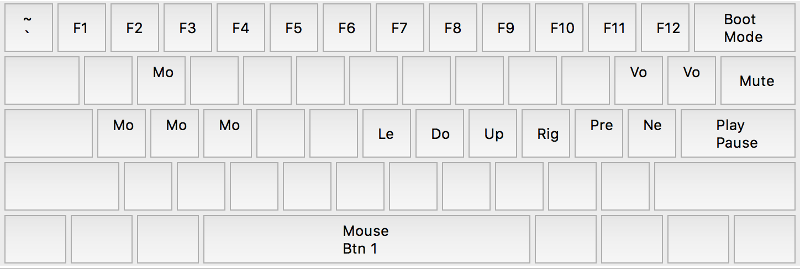

# keyboard_layouts
Layouts for my many keyboards

# GH60
Use EasyAVR [here](https://github.com/dhowland/EasyAVR)
* File > Open Layout custom.dat
* Press reset button on bottom of pcb (or boot button, mine is fn + backspace)
* File > Build and reprogram

### macOS

### fn

### Windows

